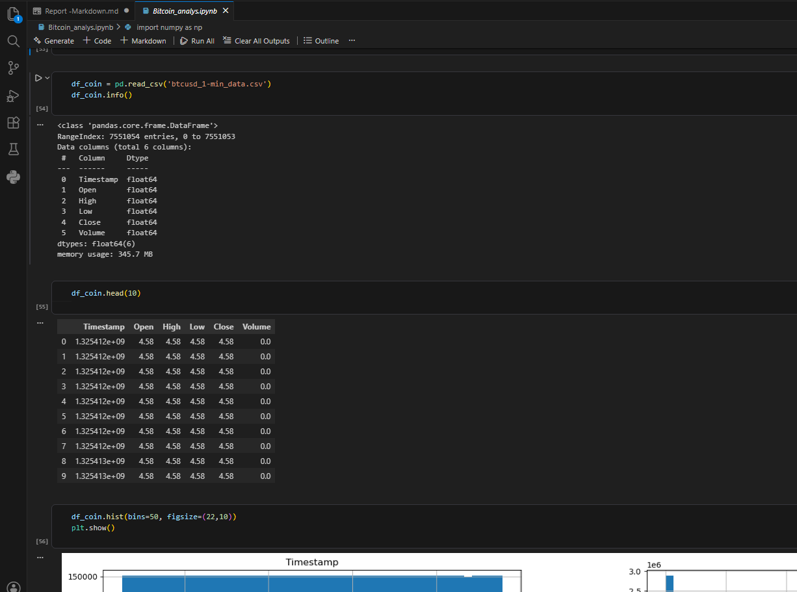

# Bitcoin-Trend-Predictor_ML
Description:  An intelligent Bitcoin trend prediction system leveraging Machine Learning  (Logistic Regression &amp; ARIMA).  This project features comprehensive data preprocessing (Time-series Resampling), feature engineering, and an interactive web dashboard built with Streamlit. Developed as a Computer and Control Engineering project.

**Motherlanguage:** Arabic

#                                                         تقرير مشروع: نظام التنبؤ الذكي لاتجاهات أسعار البيتكوين
**إعداد المهندس:** شامل صالح الغويدي  
**التخصص:** هندسة الحاسبات والتحكم - السنة الثالثة  
**التاريخ:** مايو 2026

---

## 1. المقدمة (Introduction)
يهدف هذا المشروع إلى استكشاف قدرة خوارزميات تعلم الآلة (Machine Learning) على التنبؤ باتجاهات العملات الرقمية. تم بناء نظام متكامل يبدأ من معالجة البيانات الضخمة وينتهي بواجهة مستخدم تفاعلية توفر "التوقعات كخدمة".

## 2. هندسة البيانات والميزات (Data Engineering)
لضمان دقة التحليل، لم نكتفِ ببيانات السعر الخام، بل قمنا باشتقاق ميزات رياضية (Features) تعكس سلوك السوق:

*   **العائد اللحظي (Return):** لقياس نسبة التغير السعري بين يومين متتاليين.
    $$Return = \frac{Price_{today} - Price_{yesterday}}{Price_{yesterday}}$$
*   **المتوسط المتحرك (MA_7):** لتنعيم البيانات وتقليل الضجيج السعري (Noise) خلال أسبوع.
*   **معدل التذبذب (Volatility):** لقياس درجة المخاطرة في السوق.
 *نظراً لضخامة حجم البيانات الأولية التي كانت تعتمد على الفهرسة بالدقائق (Minute-level data)، اتخذت قراراً هندسياً بتحويلها إلى الفهرس اليومي (Daily Index) للأسباب التالية:*

*   **تقليل الضجيج (Noise Reduction):** البيانات بالدقائق تحتوي على تذبذبات عشوائية لا تخدم التنبؤ طويل الأمد.

*   **كفاءة الحسابات:** تقليل عدد الصفوف ساعد في سرعة تدريب المودل وتوفير موارد الذاكرة (RAM).

*   **تنسيق المؤشرات:**  ليتماشى السعر مع المؤشرات الفنية مثل المتوسط المتحرك (Moving Average) الذي يُحسب عادةً بشكل يومي.

## 3. النماذج الخوارزمية (Modeling Strategy)

تمت المقارنة بين ثلاث منهجيات لضمان اختيار الحل الأمثل:
1.  **الاستحدار اللوجستي (Logistic Regression):** استخدم كنموذج تصنيف أساسي لتحديد الاتجاه (صعود/هبوط).
2.  **الغابة العشوائية (Random Forest):** للتعامل مع العلاقات غير الخطية والمعقدة في البيانات.
3.  **نموذج ARIMA:** لتحليل السلاسل الزمنية (Time Series) بالاعتماد على الأنماط التاريخية.

## 4. النتائج والتحليل الإحصائي

أظهرت النتائج تبايناً منطقياً يعكس طبيعة الأسواق المالية:

*   **نموذج ARIMA:** حقق متوسط مربع خطأ (MSE) قدره $$254703.78$$.
*   **دقة التنبؤ:** بلغت دقة المودل في توقع الاتجاه الصحيح $$44.00\%$$.
*   **التحليل الهندسي:** تشير النتائج إلى أن سعر البيتكوين يتبع نمط "السير العشوائي" (Random Walk)، مما يجعل التنبؤ بالاتجاه تحدياً يتطلب ميزات إضافية مثل تحليل الأخبار (Sentiment Analysis).

## 5. واجهة المستخدم والتنفيذ (Deployment)

تم تطوير واجهة مستخدم تفاعلية باستخدام إطار عمل **Streamlit** لتمكين المستخدم من:
*   إدخال بيانات السوق الحالية.
*   معالجة البيانات برمجياً في الخلفية (Backend).
*   الحصول على توقع فوري من المودل المُدرب مسبقاً (`.pkl`).

## 6. التحديات التقنية والحلول
بصفتي مهندس حاسب، واجهت عدة تحديات برمجية أثناء التنفيذ وتم حلها بنجاح:
*   **إدارة البيئات (Environment Management):** حل مشاكل تعارض مكتبات `scikit-learn` و `joblib` وتوحيد المسارات في VS Code.
*   **التحكم في العمليات (Process Control):** حل مشكلة `WinError 32` الناتجة عن تداخل العمليات في نظام التشغيل أثناء التثبيت.
.
.
.
##7. **الصدق المهني:**
 لو كان مودل بسيط مثل Logistic Regression يتنبأ بالبيتكوين بدقة $90\%$،
  لأصبح الجميع أثرياء. في الشركات الكبرى، مودل بدقة $52\%$ يعتبر "منجماً للذهب" إذا تم استخدامه مع إدارة مخاطر صحيحة.
---
**توقيع المهندس:**  
*شامل صالح الغويدي*
